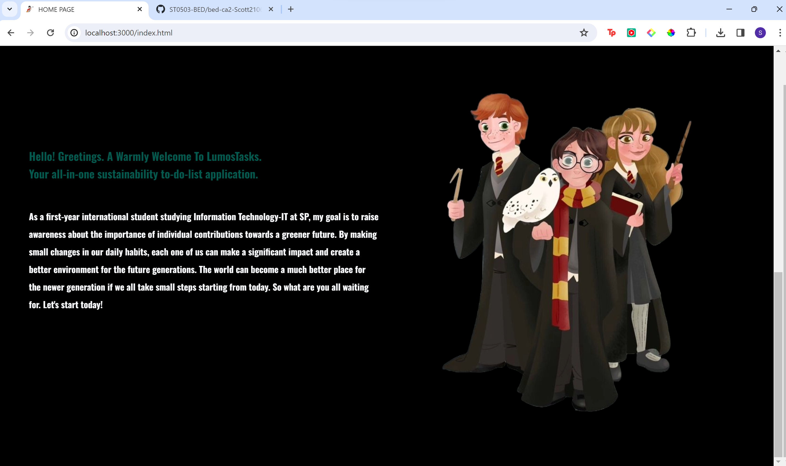

# Welcome to Lumos Task. #
## Harry Potter Inspired Sustainability Task Tracker ##
## Set Up and How to Run The Application:
- run 'npm i' in the terminal to install all the necessary packages.  
- run 'npm start' to start our own server in the local host(you may use 'npm run dev' to automatically restart our server after changes in codes are made). 
- run the sql script in your MYSQL workbench. 
- you may start interacting with the application through web pages. ##   
#### For illustrative purpose, the password is a lowercase version of the username, with no spaces. For example,username:Hermione Granger, password:hermionegranger ####
 

This the landing page of my application. The navbar includes 6 functionalitites:
* going back to the index page,
* viewing user details(modifying single user details and leaderboard),
* to-do tasks,
* virtual items that users can buy or trade,
* global messaging and
* login, logout and register.

This is Log in page. After the user has submitted the form, bcrypt library compares the entered password with the hashed password from the database. If the credentials are correct, users are given access token and can start interacting with the application.

This is register page. After user has submitted the form, the passwords are securely salted and hashed and users will be given the jwt token. (only allow password of more than 10 characters for more secure experience.)

Dropdown box shows log-in and register if the user does not have token.

Dropdown box only indicates log-out for those users with valid token.

Implement jwt token verifying and refreshing function in all of the html pages to ensure that users have valid token to do related stuffs.

Check for html params to make sure user cannot manipulate params and perform functions to accounts they do not own.

Users can terminate their accounts or update their profile pictures. They can also view details such as how many tasks they have completed, how many items they own and how much galleons they have.

Leaderboard of users based on the numbers of tasks they have completed.

This page contains all the tasks user can participate in. After they have completed, they may press the +add button to keep record.

Global messaging page where user can interacts with each other. Users can add, edit and delete messages of their own but cannot do those tasks for other users. The edit button and delete button only appear when the hovered message item was posted by the user himself. 

This is the page related to virtual items of the wizarding world.

Users may buy or trade the items with the one they own.

They can also give ratings which were later displayed in the item cards.

Users can also participate in lucky draw. The rule of the lucky draws are
- users cannot draw more than once on the same day.
- if you win an item that you have already owned, your lucky draw will be cancelled as the rule of the games dictates that you cannot possess same two items. 